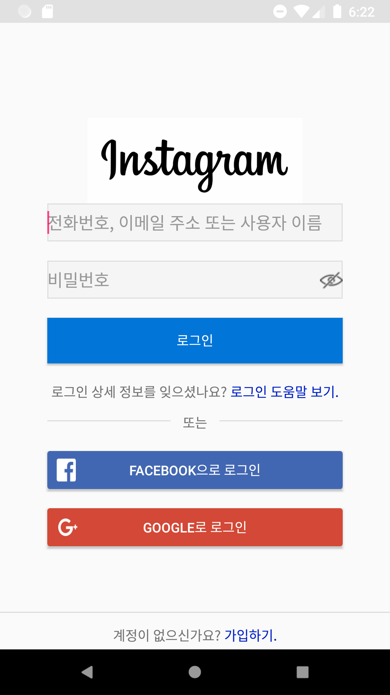
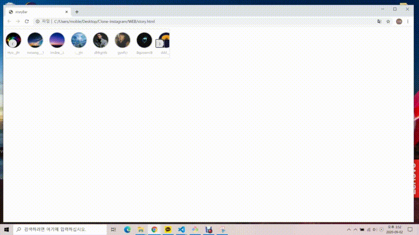
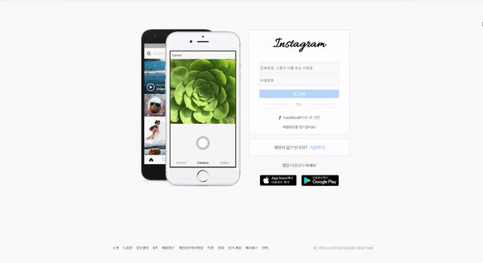
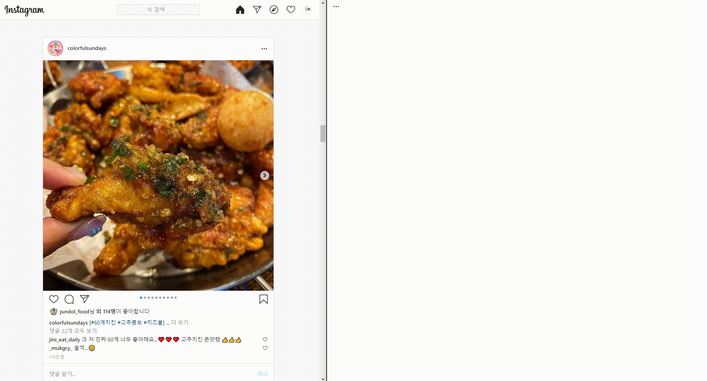

# 개발일지

## 진행 방법

1. 날짜 별로 진행사항을 기록합니다.
2. 코드리뷰 시간을 꼭 갖습니다.

<hr>

### 모든인원

**_2020.08.25 (화)_**

1. DB
   - 테이블 종류
   ```
   +---------------------------+
   | Tables_in_clone_instagram |
   +---------------------------+
   | post                      |
   | post_comment              |
   | user                      |
   | user_post                 |
   +---------------------------+
   ```
   - post 테이블
   ```
   +-------------+-------------+------+-----+---------+----------------+
   | Field       | Type        | Null | Key | Default | Extra          |
   +-------------+-------------+------+-----+---------+----------------+
   | post_id     | int         | NO   | PRI | NULL    | auto_increment |
   | id          | varchar(20) | NO   |     | NULL    |                |
   | file        | varchar(50) | NO   |     | NULL    |                |
   | content     | text        | YES  |     | NULL    |                |
   | comment     | varchar(20) | YES  |     | NULL    |                |
   | likes       | varchar(20) | YES  |     | NULL    |                |
   | upload_date | datetime    | NO   |     | NULL    |                |
   +-------------+-------------+------+-----+---------+----------------+
   ```
   - post_comment 테이블
   ```
   +--------------+-------------+------+-----+---------+-------+
   | Field        | Type        | Null | Key | Default | Extra |
   +--------------+-------------+------+-----+---------+-------+
   | id           | varchar(20) | NO   |     | NULL    |       |
   | post_index   | int         | NO   |     | NULL    |       |
   | content      | text        | NO   |     | NULL    |       |
   | likes        | varchar(20) | YES  |     | NULL    |       |
   | comment_date | datetime    | NO   |     | NULL    |       |
   +--------------+-------------+------+-----+---------+-------+
   ```
   - user 테이블
   ```
   +----------+-------------+------+-----+---------+-------+
   | Field    | Type        | Null | Key | Default | Extra |
   +----------+-------------+------+-----+---------+-------+
   | id       | varchar(20) | NO   | PRI | NULL    |       |
   | password | varchar(20) | NO   |     | NULL    |       |
   | nickname | varchar(20) | NO   |     | NULL    |       |
   | name     | varchar(20) | NO   |     | NULL    |       |
   +----------+-------------+------+-----+---------+-------+
   ```
   - user_post 테이블
   ```
   +---------------+-------------+------+-----+---------+-------+
   | Field         | Type        | Null | Key | Default | Extra |
   +---------------+-------------+------+-----+---------+-------+
   | id            | varchar(20) | NO   |     | NULL    |       |
   | post_index    | int         | YES  |     | NULL    |       |
   | follow        | varchar(20) | YES  |     | NULL    |       |
   | follower      | varchar(20) | YES  |     | NULL    |       |
   | bookmark_post | varchar(20) | YES  |     | NULL    |       |
   +---------------+-------------+------+-----+---------+-------+
   ```
2. 메인페이지 합치기( 조인태, 김효진, 이가희)

   

---

### 권용

**_2020.08.26 (수)_**

1. 안드로이드 로그인페이지



2. Kotlin기초 공부

**_2020.08.27 (목)_**

1. Kotlin의 함수사용법 및 클래스 이용

**_2020.08.28 (금)_**

1. Kotlin 고차함수와 람다함수, 스코프 함수, 오브젝트, 옵저버패턴의 이해

**_2020.08.31 (월)_**

1. 비밀번호 눈 표시 클릭 시 패스워드의 InputType변경(visible->hidden, hidden->visible)

---

### 김효진

**_2020.08.27 (목)_**

1. 연습을 위한 반응형 상단바 구현

   

2. 자바스크립트 공부

**_2020.09.01 (수)_**

1. story bar 구현

   

---

### 이가희

**_2020.08.31 (월)_**

1. 메인 화면 - 상단바

   

**_2020.09.01 (화)_**

1. 메인 화면 - 사이드

   

---

### 안덕우

---

### 조인태

**_2020.08.24 (월)_**

1. 로그인 페이지

   

2. Git MarkDown파일 작성

**_2020.08.27 (목)_**

1. 게시판 - 사진 슬라이드

   

2. 게시판 - 모달창

   

**_2020.08.31 (월)_**

1. 게시판 - 전체 통합

   

---

### 코드리뷰

**_2020.08.26 (수) 1회차_**

1. 조인태 - _로그인 페이지_

   

부족한 점

    1. 실제 로그인 페이지에는 핸드폰 이미지 부분이 동적으로 변화하는 이미지이다.
    2. 질문에 대한 답을 할때 빠르게 답변을 하려다 보니 횡설수설함..( 질문의 의도를 정확하게 파악하고 생각을 정리 후 답변하겠습니다.)

---

**_2020.08.26 (수) 2회차_**

1. 권용 - _안드로이드 로그인 페이지_

   

부족한 점

    1. 키패드 입력할 때 키패드가 올라 오는 것에 맞춰 UI가 그에 맞춰지게 하여야한다.
    2. 코드리뷰할 때 layout과 코드를 같이 설명하려니 너무 꼬여버려서 무슨 이야기하는지 나도 잘 몰랐다. 더욱 신중히 차근차근 리뷰를 해야겠다.
    3. 아직 코틀린에 익숙하지 않아 코드를 짤 때 살짝씩 꼬인다. 더욱 연습해야겠다.

2. 조인태 - _게시글 HTML/CSS/JavaScript_

   

부족한 점

    1. 슬라이드 버튼이 이미지가 처음이면 왼쪽 버튼이 없어지고 끝이면 오른쪽 버튼이 없어지는 기능을 추가 구현해야한다.
    2. 이미지를 background-image 미리 3가지 다 load한 상태에서 진행하기 때문에 메모리가 비효율적이다.
    canvas를 공부하여 이미지를 버튼 클릭 시 load 하는 방향으로 수정해야한다.(canvas는 새로운 이미지가 불러올때 그려지기 때문에 메모리가 효율적일 것 같다.)

---

**_2020.09.93 (목) 3회차_**

1. 김효진 - _스토리 HTML/CSS/JS_

   

부족한 점

1. 클래스의 명이 명시적이지 못한 점
2. JavaScript 구현 부분에 신경을 써서 설명을 하다보니, css에 대한 설명이 제대로 이루어지지 않은 것 같다.

3. 이가희 - _상단바 + 사이드바 HTML/CSS/JS_

   

부족한 점

    1. 적어주세요
