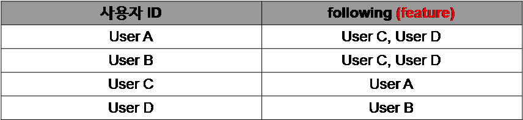
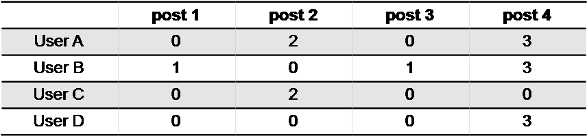
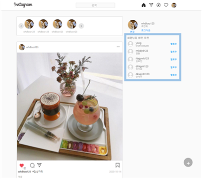

# Instagram Recommend

## 친구 추천

### 콘텐츠 기반 필터링

사용자가 팔로우 한 사람을 기준으로 이와 비슷한 feature를 가진 다른 사용자를 추천함.

1. Database Query

2. CountVectorizer
 - 문서 집합에서 단어 토큰을 생성하고 각 단어의 수를 세어 BOW 인코딩한 벡터를 만듬
 - feature의 각 단어를 공백으로 나눈 후 CountVectorizer처리
 - follow 문자열을 Count 백터화(나눈 문자의 출현 빈도를 세어 벡터(집합)로 변환)

3. Cosine Similarity
 - 각 id에 따른 팔로우별 cosine유사도 추출(백터 사이의 각도만으로 유사도를 추출)

 

4. 유사도가 높은 순으로 정렬

5. 함께아는 친구 계산

6. 결과

## 피드 추천

자신이 좋아요를 누른 피드에 다른사람이 좋아요를 누르면 나와 그 사람의 관심사가 비슷하구나라는 아이디어

1. 데이터베이스 값 불러오기

 

2. 널 값을 0으로 초기화

3. 피드의 좋아요를 누른 사용자들의 cosine_similarity 적용

4. - 예측 like -> 사용자가 좋아요한 게시글에 그와 유사한 게시글의 합 반환
   - 결국 각각에 대한 점수들이 매겨짐 -> 유사도에 따른 예측 점수
   

5. - 원본데이타의 점수와 예측 점수를 비교함
   - 사용자가 조아요를 누른 게시글에 대해서만 예측성능평가 mse를 구함

6. 유사도가 큰 순으로 정렬

7. 자신이 좋아요를 누른 것은 뺌

8. 좋아요를 누르지 않은 피드 중 예측률이 높은 순으로 정렬함

9. 결과

    
    
    - 현재 사용자 "권용"에게 5번째 인덱스에 있는 피드를 추천 

## 최종 결과

### 친구 추천
 

### 피드 추천
  