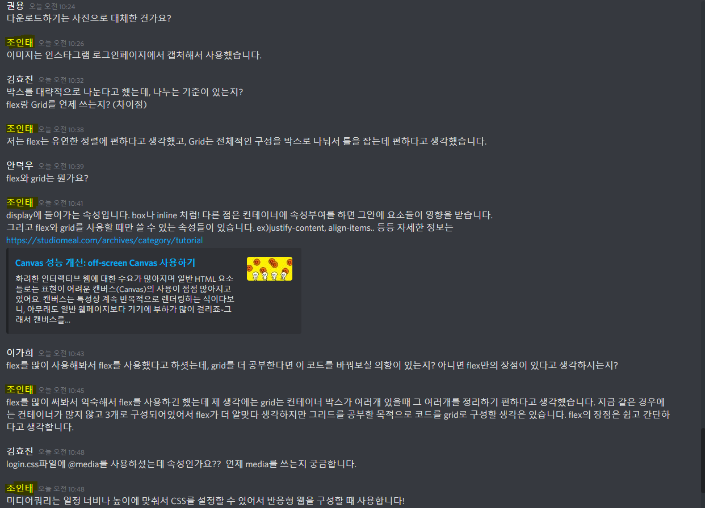
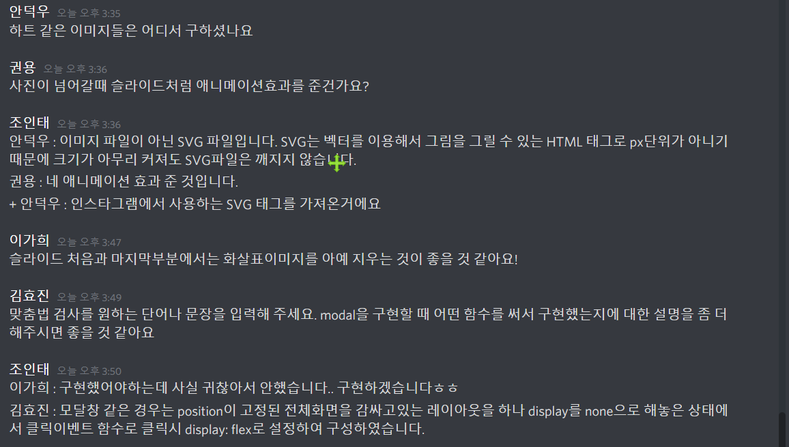
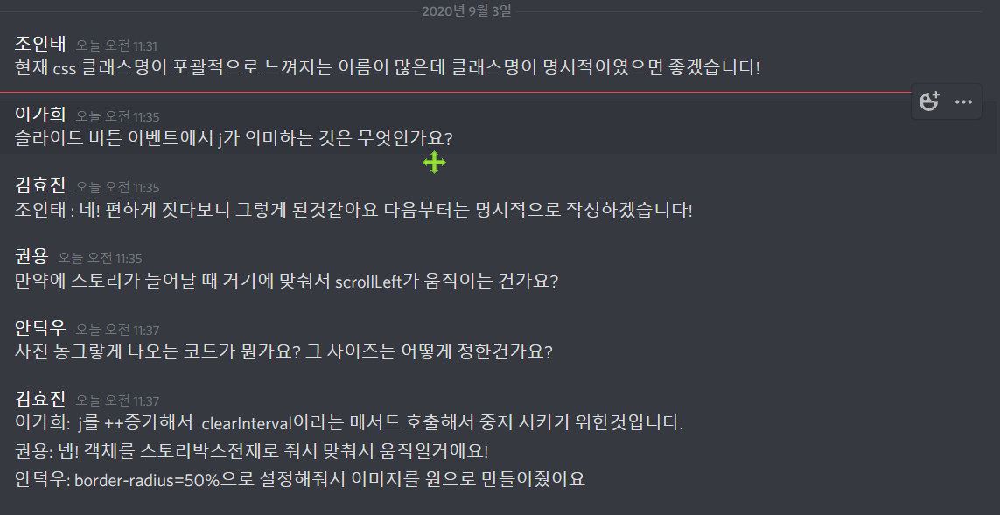
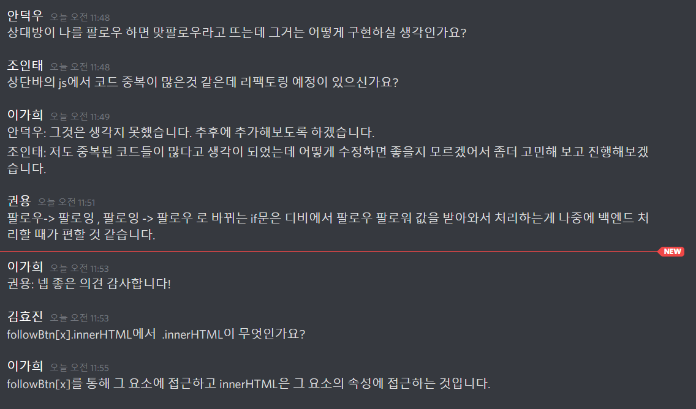
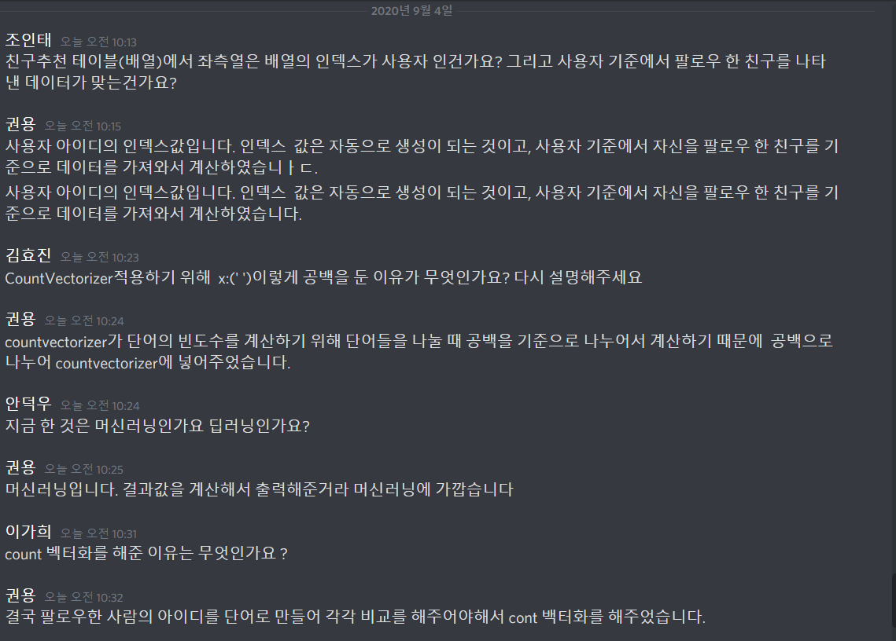

## 코드리뷰

**_2020.08.26 (수) 1회차_**

1. 조인태 - _로그인 페이지_

   

부족한 점

    1. 실제 로그인 페이지에는 핸드폰 이미지 부분이 동적으로 변화하는 이미지이다.
    2. 질문에 대한 답을 할때 빠르게 답변을 하려다 보니 횡설수설함..( 질문의 의도를 정확하게 파악하고 생각을 정리 후 답변하겠습니다.)

---

**_2020.08.26 (수) 2회차_**

1. 권용 - _안드로이드 로그인 페이지_

   

부족한 점

    1. 키패드 입력할 때 키패드가 올라 오는 것에 맞춰 UI가 그에 맞춰지게 하여야한다.
    2. 코드리뷰할 때 layout과 코드를 같이 설명하려니 너무 꼬여버려서 무슨 이야기하는지 나도 잘 몰랐다. 더욱 신중히 차근차근 리뷰를 해야겠다.
    3. 아직 코틀린에 익숙하지 않아 코드를 짤 때 살짝씩 꼬인다. 더욱 연습해야겠다.

2. 조인태 - _게시글 HTML/CSS/JavaScript_

   

부족한 점

    1. 슬라이드 버튼이 이미지가 처음이면 왼쪽 버튼이 없어지고 끝이면 오른쪽 버튼이 없어지는 기능을 추가 구현해야한다.
    2. 이미지를 background-image 미리 3가지 다 load한 상태에서 진행하기 때문에 메모리가 비효율적이다.
    canvas를 공부하여 이미지를 버튼 클릭 시 load 하는 방향으로 수정해야한다.(canvas는 새로운 이미지가 불러올때 그려지기 때문에 메모리가 효율적일 것 같다.)

---

**_2020.09.03 (목) 3회차_**

1. 김효진 - _스토리 HTML/CSS/JS_

   

부족한 점

    1. 클래스의 명이 명시적이지 못한 점
    2. JavaScript 구현 부분에 신경을 써서 설명을 하다보니, css에 대한 설명이 제대로 이루어지지 않은 것 같다.

3. 이가희 - _상단바 + 사이드바 HTML/CSS/JS_

   

부족한 점

    1. 구현하고자 하는 페이지의 디테일한 부분들을 캐치하지 못해서 그 부분들에 대해 더 생각해봐야 할 것 같다.
    2. 중복된 코드들이 많아서 쓸데없이 코드의 길이가 길어 비효율적이다.

**_2020.09.04 (금) 4회차_**

1. 권용 - 머신러닝(친구 추천)

   
   
부족한 점

    1. 코드리뷰를 하면서 알고리즘 구현 중 실수를 알아 다시 수정해야하는 일이 발생하였다. 더욱 신중히 생각해야겠다.
    2. 머신러닝의 구조를 정확히 리뷰하지 못하였다.

2. 안덕우 - 안드로이드 로그인 기능

   

부족한 점

    1. 적어주세요